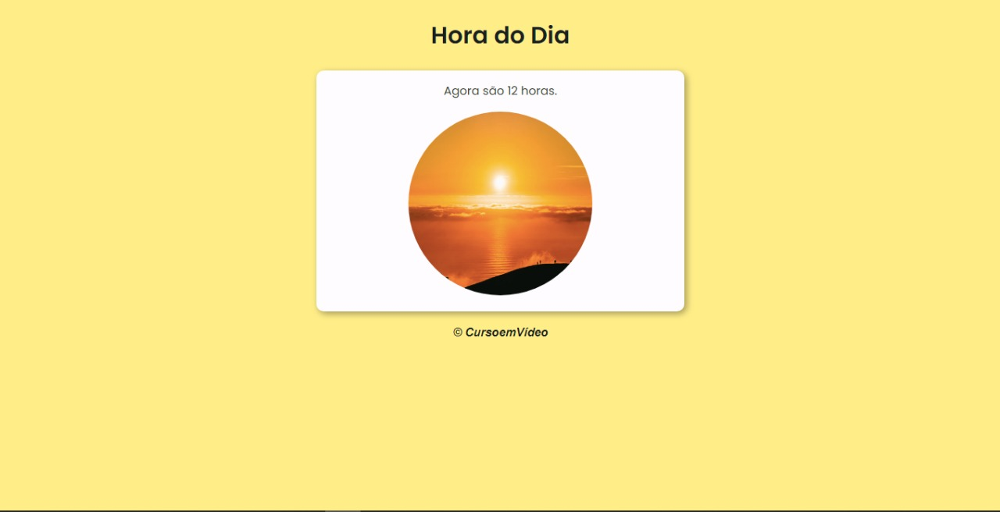
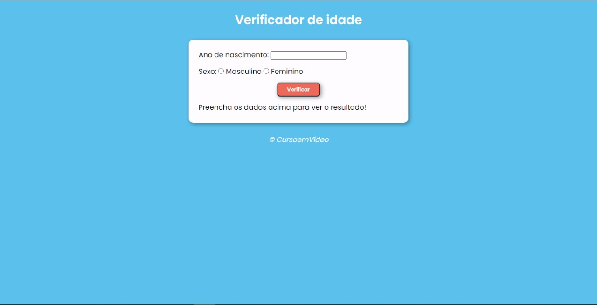

<head>
    <!-- FONT -->
        <link rel="preconnect" href="https://fonts.googleapis.com">
        <link rel="preconnect" href="https://fonts.gstatic.com" crossorigin>
        <link href="https://fonts.googleapis.com/css2?family=Poppins&display=swap" rel="stylesheet">
</head>
<h1 style="font: 400 25px Poppins, sans-serif;">
    Curso em Vídeo JS
</h1>

<h2 style="font: 400 20px Poppins, sans-serif;">
    Projeto em HTML/CSS e JS
</h2>

    Alguns exerícios com algumas alterações dos desafios do Curso em Vídeo de JavaScript

 

#  Designs
<h2 style="font: 400 20px Poppins, sans-serif;">
    Hora do Dia
</h2>
 

Projeto que diz a hora do dia e interaje de acordo com o horário

 

<h2 style="font-family: 'Poppins', sans-serif;">
Detector de Idade
</h2>
 

